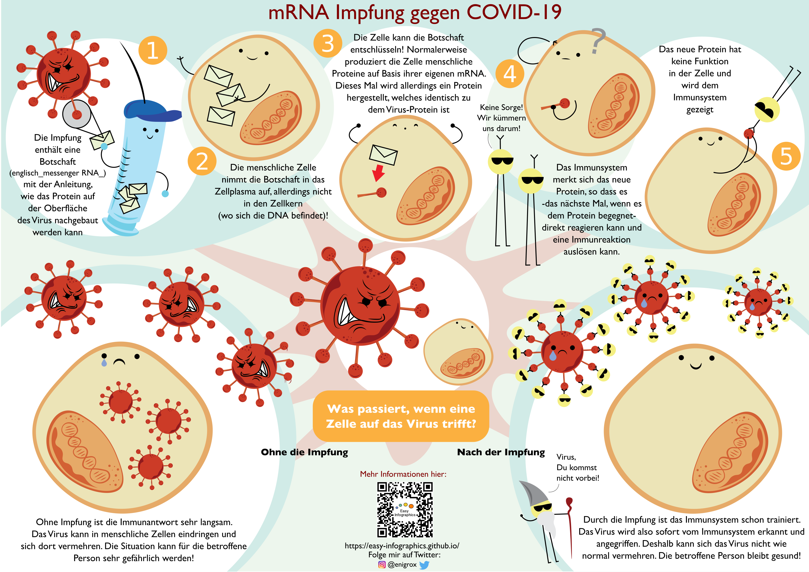
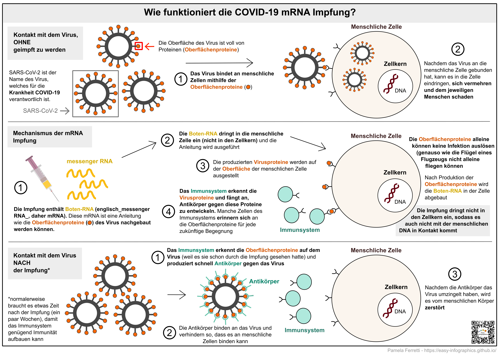

[Zurück zur Startseite](https://easy-infographics.github.io/de/)

**Diese Seite ist auch in anderen Sprachen verfügbar:** 🇮🇹  [Italian](../it/) 🇵🇹 [Portuguese](../pt/) 🇫🇷 [French](../fr/) 🇬🇧 [Englisch](../) 🇪🇸 [Spanisch](../es/) 🇷🇺 [Russisch](../ru/)

Auf dieser Seite können Sie verschiedene Infographiken zu COVID-19 finden. Falls die Graphik nicht von mir selbst erstellt wurde, ist ein Hinweis mit den Namen der Autoren beigefügt.
**Diese Infographiken haben zum Ziel, bestimmte Fragen zu COVID-19, die mir in letzter Zeit häufiger gestellt worden sind, in klarer und einfacher Sprache zu beantworten**.

# Wie funktioniert die COVID-19 mRNA Impfung?

Diese Illustration soll auf lustige und bunte Art und Weise verdeutlichen, wie die mRNA Impfung funktioniert und was (mit und ohne Impfung) passiert, wenn SARS-CoV-2 (das Virus, welches für COVID-19 verantwortlich ist) auf menschliche Zellen trifft.

Illustration von: Eleonora Nigro ([@enigrox](https://twitter.com/enigrox))

Hier kann man sehen, wie menschlichen Zellen **vor, während und nach der mRNA Impfung** reagieren, wenn sie mit SARS-CoV-2 (das Virus, welches für COVID-19 verantwortlich ist) beziehungsweise mit der mRNA im Impfstoff in Kontakt kommen.

Gegen COVID-19 sind auch noch andere Arten von Impfungen erhältlich, welche nicht auf mRNA basieren. Der Einfachheit halber konzentrieren wir uns hier auf die neuartigen mRNA Impfstoffe. Bisher wurden zwei COVID-19 Impfstoffe auf mRNA-Basis zugelassen, welche von Pfizer-BioNTech oder von Moderna produziert werden.
Bild der Spritze von [Pixabay](https://pixabay.com/users/janjf93-3084263/).

### Warum sind Impfungen sinnvoll?

**Die Impfung ermöglicht es dem menschlichen Immunsystem, sich an das Virus zu "erinnern". Falls das Immunsystem dann später auf das Virus trifft, kann der menschliche Körper dann schnell und effizient reagieren**.

### Was genau ist mRNA eigentlich?

Obwohl mRNA und die neuartigen mRNA Impfungen erst vor Kurzem in den Fokus der Medien gerückt sind, ist mRNA alles andere als neu. mRNA ist ein Teil der **natürlichen Funktionsweise des menschlichen Körpers** und wird in so gut wie jeder Zelle dauernd produziert und wieder abgebaut. **Mehr Details zu mRNA sind auf der [Zellbiologie-Seite](https://easy-infographics.github.io/Cell_Biology/de/) zu finden.**

Andere Illustrationen folgen in Kürze :)

***

### Über uns

Erstellung der Illustrationen:

* **Pamela Ferretti** : Ich bin Doktorandin am EMBL Heidelberg und forsche dort mithilfe von Bioinformatik an Bakterien und ihrer Rolle für die menschliche Gesundheit. Twitter: [@pam_ferretti](https://twitter.com/pam_ferretti)

* **Eleonora Nigro** : Ich bin Forschungsassistentin an der Universität Kopenhagen, wo ich mich mit Bakterien und metabolischen Interaktionen im menschlichen Verdauungstrakt befasse. Wenn ich nicht an Bakterien forsche, male ich sie besonders gerne in jeder Form! Twitter: [@enigrox](https://twitter.com/enigrox)

Übersetzung ins Deutsche: **Jakob Wirbel**

### Interessenkonflikte

Keine.

### Finanzierung

Dieses Projekt ist das Resultat meiner Freizeit und der Freizeit all derer, die mir geholfen und mich beraten haben.

### Lizenz

Diese Arbeiten sind publiziert unter der 
[Creative Commons Attribution-ShareAlike 4.0 International License][cc-by-sa] Lizenz.

[![CC BY-SA 4.0][cc-by-sa-image]][cc-by-sa]

[cc-by-sa]: http://creativecommons.org/licenses/by-sa/4.0/
[cc-by-sa-image]: https://licensebuttons.net/l/by-sa/4.0/88x31.png
[cc-by-sa-shield]: https://img.shields.io/badge/License-CC%20BY--SA%204.0-lightgrey.svg
