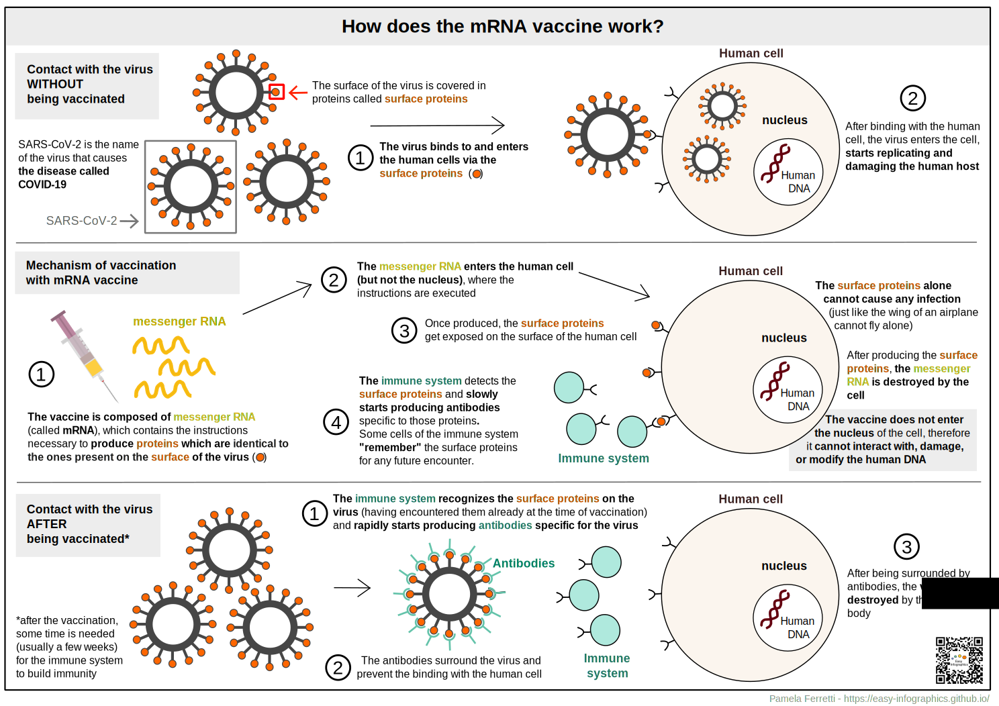

**Check out this page also in other languages:**

🇮🇹  [italian](../it/)

Here are collected my infographics on COVID-19 in English. When not done by me, you can find the author(s) credits below the illustration. 
**These illustrations aim at answering in a clear and simplified way specific questions that were asked to me**, by friends and family. 

# Why are vaccines useful?

**credits: Eleonora Nigro (Twitter: @nigrelex)**

This illustration shows in a colorful and fun way what happens when COVID-19 virus encounters a human cell. There are three scenarios: before, during and after the vaccination.
**Vaccination allows our immune system to "remember" the virus and in case of a future encounter our body will be able to respond in a rapid and effective way.** 

# How does the mRNA vaccine work?

Here you can see what happens to our cells when they get in contact with SARS-CoV-2 (the virus that causes the COVID-19 disease) **before, during and after the vaccination with mRNA vaccine.**
mRNA vaccines are not the only type of vaccine available against COVID-19, but for simplicity are the only one described in this infographic.

[syringe image source](https://pixabay.com/users/janjf93-3084263/)

# What is an mRNA after all? 

Well, while you might have heard mRNA vaccines being mentioned in the news headlines, mRNA is all but recent. Infact, mRNA is produced and destroyed by your cells every second, since you were born, and it's **naturally part of how our body works.**
You can find a dedicated illustration in [what is mRNA -english version]() in the [Cell Biology]() section. 

**more illustrations coming soon :)**

### Conflict of interests

None.

### Funding

This project is the result of my spare time, and the one of the people (see section below) that collaborated in the process of making and revising the illustrations. 

### License
This work is licensed under a
[Creative Commons Attribution-ShareAlike 4.0 International License][cc-by-sa].

[![CC BY-SA 4.0][cc-by-sa-image]][cc-by-sa]

[cc-by-sa]: http://creativecommons.org/licenses/by-sa/4.0/
[cc-by-sa-image]: https://licensebuttons.net/l/by-sa/4.0/88x31.png
[cc-by-sa-shield]: https://img.shields.io/badge/License-CC%20BY--SA%204.0-lightgrey.svg
