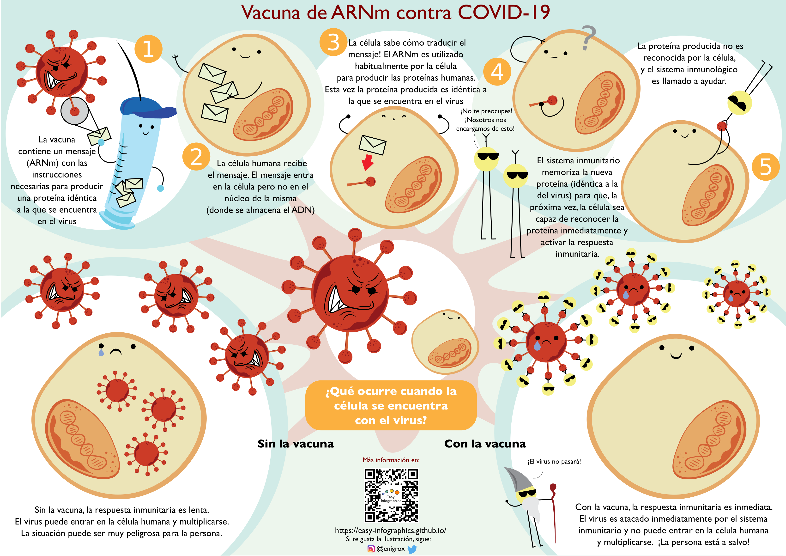
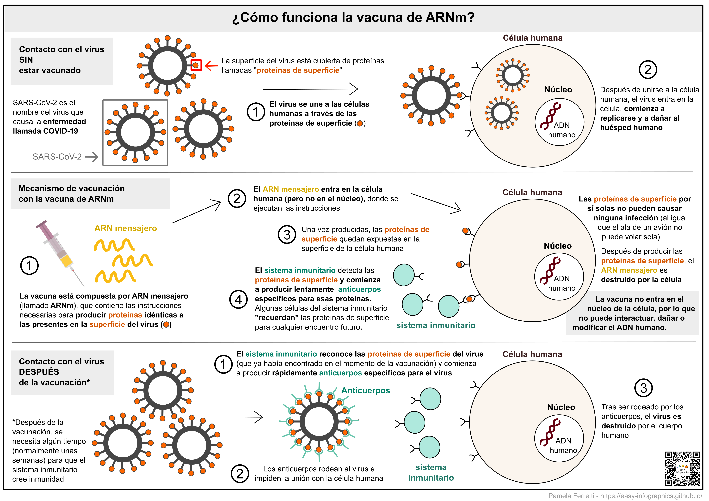

[Ir a la página principal](https://easy-infographics.github.io/es/)

**Mira esta página también en otros idiomas:** 🇮🇹  [Italiano](../it/) 🇵🇹 [Portugués](../pt/) 🇬🇧 [Inglés](../) 🇫🇷 [Francés](../fr/) 🇩🇪 [Alemán](../de/)

A continuación encontrarás una colección de infografías sobre COVID-19. Cuando no han sido creadas por mí, puedes encontrar los créditos del autor o autores debajo de la ilustración. 
**Estas ilustraciones pretenden responder de forma clara y simplificada a preguntas concretas que me han hecho**. 

# ¿Cómo funciona la vacuna contra COVID-19 de ARNm?

Esta ilustración pretende mostrar, de forma colorida y divertida, cómo funciona la vacuna contra COVID-19 de ARNm y qué ocurre cuando el SARS-CoV-2 se encuentra con una célula humana (con y sin la vacunación).

Créditos de esta ilustración: Eleonora Nigro ([@enigrox](https://twitter.com/enigrox))

Aquí se puede ver lo que ocurre con nuestras células cuando entran en contacto con el SARS-CoV-2 (el virus que causa la enfermedad COVID-19) **antes, durante y después de la vacunación con la vacuna de ARNm.**

Las vacunas de ARNm no son el único tipo de vacuna disponible contra la COVID-19, pero para simplificar son las únicas descritas en esta infografía. Las vacunas de ARNm contra la COVID-19 aprobadas incluyen las producidas por Pfizer-BioNTech y Moderna. Imagen de jeringa obtenida de [Pixabay](https://pixabay.com/users/janjf93-3084263/).

### ¿Por qué son útiles las vacunas?

**La vacuna permite a nuestro sistema inmunitario "recordar" el virus. En caso de un futuro encuentro, nuestro cuerpo será capaz de responder a él de forma rápida y eficaz.**

### ¿Qué es un ARNm después de todo? 

Bueno, aunque es posible que hayas oído hablar de las vacunas de ARNm en los titulares de las noticias recientes, el ARNm es todo menos reciente. De hecho, el ARNm ha sido producido y destruido por tus células cada segundo desde que naciste, y es **parte natural de cómo funciona nuestro cuerpo.**
**Puedes encontrar una ilustración dedicada en la sección [Biología Celular](https://easy-infographics.github.io/Cell_Biology/es/).**

pronto habrá más ilustraciones :)

***

### Créditos

Por la creación de las ilustraciones:

* **Pamela Ferretti** : Soy estudiante de doctorado en biología computacional en el EMBL de Heidelberg (Alemania), donde estudio las bacterias y su papel en la salud humana. Twitter: [@pam_ferretti](https://twitter.com/pam_ferretti)

* **Eleonora Nigro** : Soy asistente de investigación en la Universidad de Copenhague, donde estudio las interacciones entre bacterias y metabolitos en el intestino humano... Además de estudiarlas, ¡me gusta dibujar bacterias por todas partes!Twitter: [@enigrox](https://twitter.com/enigrox)

Para traducir la página, el texto y las ilustraciones en español: **Miguelangel Cuenca**

### Conflicto de intereses

Ninguno.

### Financiación

Este proyecto es el resultado de mi tiempo libre, y el de las personas que colaboraron en el proceso de realización y revisión de las ilustraciones. 

### Licencia

Este trabajo está licenciado bajo una
[Creative Commons Attribution-ShareAlike 4.0 International License][cc-by-sa].

[![CC BY-SA 4.0][cc-by-sa-image]][cc-by-sa]

[cc-by-sa]: http://creativecommons.org/licenses/by-sa/4.0/
[cc-by-sa-image]: https://licensebuttons.net/l/by-sa/4.0/88x31.png
[cc-by-sa-shield]: https://img.shields.io/badge/License-CC%20BY--SA%204.0-lightgrey.svg
