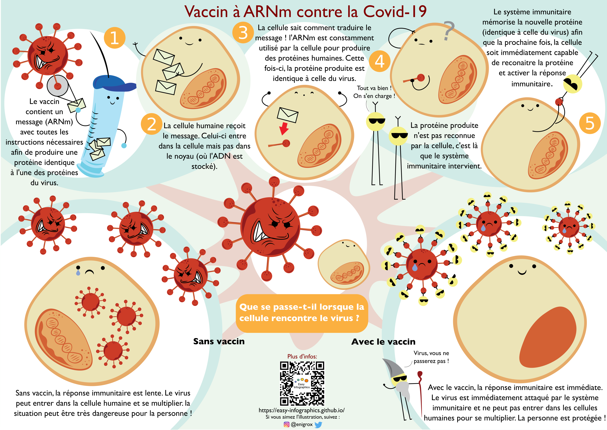
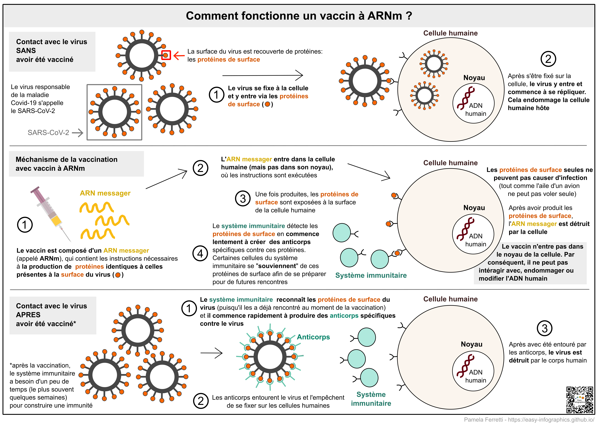

[Page d'accueil](https://easy-infographics.github.io/fr/)

**Accéder à cette page dans une autre langue** 🇮🇹  [Italien](../it/) 🇵🇹 [Portugais](../pt/) 🇬🇧 [Anglais](../en/) 🇩🇪 [Allemand](../de/) 🇪🇸 [Espagnol](../es/)

Vous trouverez ci-dessous une série d'illustrations sur la Covid-19. Si elles n'ont pas été réalisées par moi, vous trouverez l'auteur dans les remerciements sous l'illlustration.
**Ces illustraitions ont pour but de répondre de manière claire et concise à des questions spécifiques qui m'ont été posées**.

# Comment fonctionne le vaccin à ARNm contre la Covid-19 ?

Cette illustration cherche à montrer, de manière fun et colorée, comment fonctionne le vaccin à ARNm et ce qu'il se passe lorsque le virus SARS-CoV-2 rencontre une cellule humaine (avec et sans vaccination).

**Illustration par : Eleonora Nigro** ([@enigrox](https://twitter.com/enigrox))

Vous pouvez voir ici ce qu'il se passe pour nos cellules lorsqu'elles entrent en contact avec le SARS-CoV-2 (le virus responsable de la maladie Covid-19) **avant, pendant et après la vaccination par le vaccin à ARNm.**

Les vaccins à ARNm ne sont pas le seul type de vaccin disponibles contre la Covid-19, mais pour des raisons de simplicité, cette illustation ne décrit que ceux-là. Les vaccins à ARNm validés contre la Covid-19 sont ceux produits par Pfizer-BioNTech et Moderna. Image de seringue obtenue sur [Pixabay](https://pixabay.com/users/janjf93-3084263/).

### Pourquoi les vaccins sont-ils utiles ?

**La vaccination permet au sytème immunitaire de se "souvenir" du virus. En cas de rencontre future, notre corps sera capable de répondre rapidement et efficacement au virus.**

### Qu'est ce qu'un ARNm ?

Si vous n'avez entendu parler des vaccins à ARNm que récemment dans les actualités, l'ARNm est tout sauf récent. En fait, de l'ARNm est produit et détruit par nos cellules à chaque seconde, et ce depuis notre naissance.  **Cela fait partie du fonctionnement naturel de notre organisme.**
**Vous trouverez une illustration dédiée dans la section [Biologie cellulaire](https://easy-infographics.github.io/Cell_Biology/fr/) section.**

plus d'illustrations à venir :)

***

### Remerciements

Pour les illustrations :

* **Pamela Ferretti** : étudiante en thèse en biologie computationnelle à l'EMBL de Heidelberg (Allemagne) où elle étudie les bactéries et leur rôle sur la santé humaine. Twitter: [@pam_ferretti](https://twitter.com/pam_ferretti)

* **Eleonora Nigro** : assistante de recherche à l'Université de Copenhague, où elle étudie les bactéries et les interactions métaboliques dans l'intestin humain. Outre l'étude des bactéries, elle adore en dessiner partout ! Twitter: [@enigrox](https://twitter.com/enigrox)

Pour la traduction de la page, du texte et des illustraitons en français: **Léonard Dubois**

### Conflits d'interêts

Aucun.

### Financement

Ce projet est le fruit du travail bénévole de chacun de ses contributeurs (création, révisions, traduction des illustrations).

### Licence

Ce travail est distribué sous licence
[Creative Commons Attribution-ShareAlike 4.0 International License][cc-by-sa].

[![CC BY-SA 4.0][cc-by-sa-image]][cc-by-sa]

[cc-by-sa]: http://creativecommons.org/licenses/by-sa/4.0/
[cc-by-sa-image]: https://licensebuttons.net/l/by-sa/4.0/88x31.png
[cc-by-sa-shield]: https://img.shields.io/badge/License-CC%20BY--SA%204.0-lightgrey.svg
