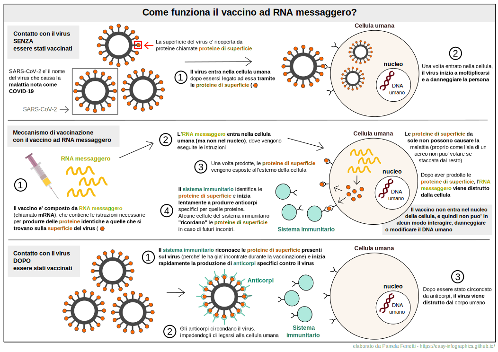

[Vai alla Home](https://easy-infographics.github.io/it/)

**Visualizza questa pagina in:** 🇬🇧 [Inglese](../en/) 🇵🇹 [Portoghese](../pt/)

In questa sezione sono raccolte le infografiche sull'argomento "COVID-19". 
**Queste illustrazioni hanno lo scopo di rispondere, in modo semplice e chiaro, a specifiche domande che mi sono state poste.** 

# Perche' i vaccini sono utili?

**Autore: Eleonora Nigro**

Questa illustrazione ha lo scopo di spiegare, in modo colorato e divertente, come funziona il vaccino ad RNA messaggero (o mRNA) contro il COVID-19 e cosa accade alle cellule del nostro corpo quando incontrano il virus. 
**La vaccinazione consente al sistema immunitario di "ricordare" il virus e di essere in grado di reagire in modo rapido ed efficace in caso di una futura infezione**

# Come funziona il vaccino COVID-19 ad RNA messaggero (o mRNA)?

**Autore: Pamela Ferretti**

L'illustrazione spiega cosa accade alle nostre cellule quando incontrano SARS-CoV-2 (il virus che causa la malattia chiamata COVID-19) **prima, durante e dopo la vaccinazione con il vaccino ad mRNA** 
I vaccini ad mRNA non sono l'unica tipologia di vaccino disponibile contro COVID-19, ma per ragioni di spazio e semplicita' sono gli unici descritti in questa illustrazione.

Immagine siringa da [Pixabay](https://pixabay.com/users/janjf93-3084263/)

### Cosa e' l'RNA messaggero? 

Molto probabilmente avete sentito parlare di RNA messaggero nei recenti notiziari. Tuttavia, l'RNA messaggero non e' affatto recente. Infatti, l'RNA messaggero viene prodotto in continuazione dalle cellule del nostro corpo, fin dalla nascita. L'RNA messaggero e' un componente naturale del corretto funzionamento delle nostre cellule. 
**Puoi trovare un'illustrazione dedicata a cosa e' esattamente l'RNA messaggero e che ruolo svolge nelle nostre cellule nella sezione [Biologia della cellula](https://easy-infographics.github.io/Cell_Biology/it/).** 

altre illustrazioni sono in preparazione :)

***

### Riconoscimenti

Per le illustrazioni:

* **Pamela Ferretti** : Sono una studentessa di dottorato in Biologia Computazionale presso l'EMBL ad Heidelberg (Germania), dove studio i batteri e il loro ruolo nella salute umana. Twitter: [@pam_ferretti](https://twitter.com/pam_ferretti)

* **Eleonora Nigro** : Twitter: [@enigrox](https://twitter.com/enigrox)

### Dichiarazione di conflitto di interessi

Nessuno.

### Finanziamento

Nessuno. 

### Licenza

Quest’opera è stata rilasciata con licenza 
[Creative Commons Attribution-ShareAlike 4.0 International License][cc-by-sa].

[![CC BY-SA 4.0][cc-by-sa-image]][cc-by-sa]

[cc-by-sa]: http://creativecommons.org/licenses/by-sa/4.0/
[cc-by-sa-image]: https://licensebuttons.net/l/by-sa/4.0/88x31.png
[cc-by-sa-shield]: https://img.shields.io/badge/License-CC%20BY--SA%204.0-lightgrey.svg
