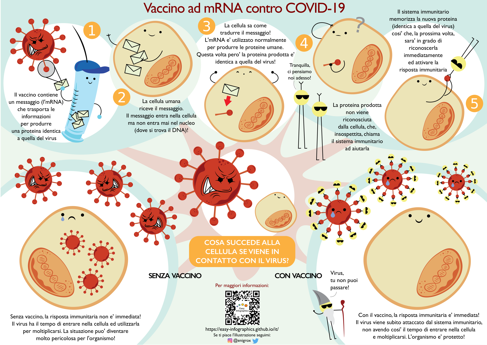
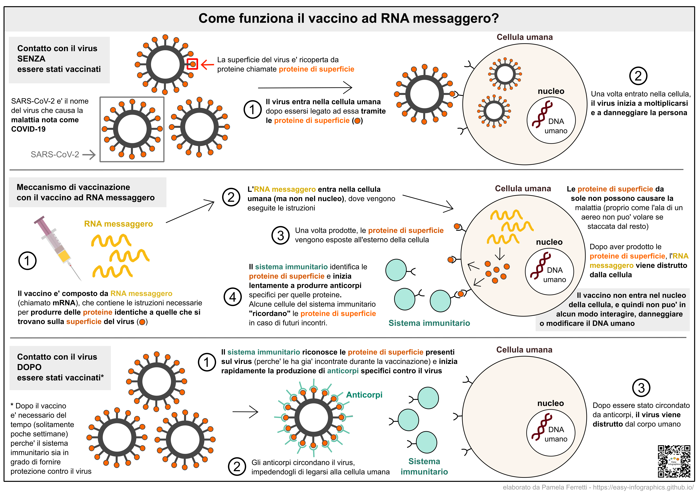

[Vai alla Home](https://easy-infographics.github.io/it/)

**Visualizza questa pagina in:** 🇬🇧 [Inglese](../en/) 🇵🇹 [Portoghese](../pt/) 🇫🇷 [Francese](../fr/) 🇩🇪 [Tedesco](../de/) 🇪🇸 [Spagnolo](../es/) 🇷🇺 [Russo](../ru/)

In questa sezione sono raccolte le infografiche sull'argomento "COVID-19". 
**Queste illustrazioni hanno lo scopo di rispondere, in modo semplice e chiaro, a specifiche domande che mi sono state poste.** 

# Come funziona il vaccino COVID-19 ad RNA messaggero (o mRNA)?

L'illustrazione sottostante ha lo scopo di spiegare, in modo semplice, colorato e divertente, cosa fa il vaccino ad mRNA una volta iniettato e cosa accade alle cellule del nostro corpo quando incontrano il virus con e senza la protezione fornita dal vaccino.

Credits: Eleonora Nigro [@enigrox](https://twitter.com/enigrox)

Questa illustrazione alternativa spiega cosa accade quando il virus SARS-CoV-2 (che causa la malattia chiamata COVID-19) incontra le cellule di un individuo non vaccinato, come funziona il vaccino ad mRNA, e infine cosa accade quando il virus incontra un individuo che ha ricevuto la vaccinazione ed e' quindi protetto. 

I vaccini ad mRNA non sono l'unica tipologia di vaccino disponibile contro COVID-19, ma per ragioni di spazio e semplicita' sono gli unici descritti in questa illustrazione. Immagine siringa da [Pixabay](https://pixabay.com/users/janjf93-3084263/)

### Perche' i vaccini sono utili?

**La vaccinazione consente al sistema immunitario di "ricordare" il virus e di essere in grado di reagire in modo rapido ed efficace in caso di una futura infezione.**

### Cosa e' l'RNA messaggero o mRNA? 

Molto probabilmente avete sentito parlare di RNA messaggero nei recenti notiziari. Tuttavia, l'RNA messaggero non e' affatto recente. Infatti, l'RNA messaggero viene prodotto in continuazione dalle cellule del nostro corpo, fin dal concepimento. L'RNA messaggero e' un componente naturale del corretto funzionamento delle nostre cellule. 
**Puoi trovare un'illustrazione dedicata a cosa e' esattamente l'RNA messaggero e che ruolo svolge nelle nostre cellule nella sezione [Biologia della cellula](https://easy-infographics.github.io/Cell_Biology/it/).** 

altre illustrazioni sono in preparazione :)

***

### Riconoscimenti

Per le illustrazioni:

* **Pamela Ferretti** : Sono una studentessa di dottorato in Biologia Computazionale presso l'EMBL a Heidelberg (Germania), dove studio i batteri e il loro ruolo nella salute umana. Twitter: [@pam_ferretti](https://twitter.com/pam_ferretti)

* **Eleonora Nigro** : Sono un'assistente di ricerca presso l'Universita' di Copenhagen, dove studio i batteri e le loro interazioni metaboliche nel tratto gastrointestinale umano... Oltre a studiare i batteri, mi diverto a disegnarli nel tempo libero! Twitter: [@enigrox](https://twitter.com/enigrox)

Per i numerosi ad utili suggerimenti sul testo sia delle illustrazioni che del sito: **Marilena Ferretti**

### Dichiarazione di conflitto di interessi

Nessuno.

### Finanziamento

Questo progetto e' il frutto del tempo libero mio e di coloro che hanno contribuito a creare e revisionare i testi e le illustrazioni.

### Licenza

Quest’opera è stata rilasciata con licenza 
[Creative Commons Attribution-ShareAlike 4.0 International License][cc-by-sa].

[![CC BY-SA 4.0][cc-by-sa-image]][cc-by-sa]

[cc-by-sa]: http://creativecommons.org/licenses/by-sa/4.0/
[cc-by-sa-image]: https://licensebuttons.net/l/by-sa/4.0/88x31.png
[cc-by-sa-shield]: https://img.shields.io/badge/License-CC%20BY--SA%204.0-lightgrey.svg
