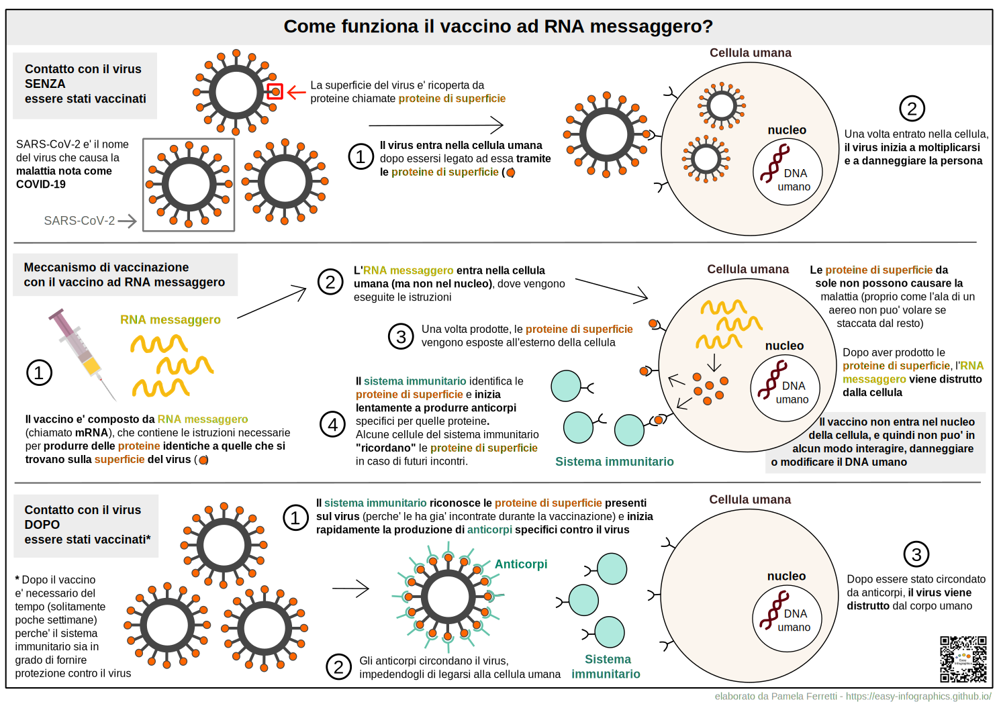

[Vai alla Home](https://easy-infographics.github.io/it/)

**Visualizza questa pagina in:** 🇬🇧 [Inglese](../en/)

In questa sezione sono raccolte le infografiche sull'argomento "COVID-19". 
**Queste illustrazioni hanno lo scopo di rispondere, in modo semplice e chiaro, a specifiche domande che mi sono state poste.** 

# Perche' i vaccini sono utili?

**credits for this illustration: Eleonora Nigro (Twitter: [@nigrelex](https://twitter.com/nigrelex?lang=en#:~:text=Eleonora%20Nigro%20(%40nigrelex)%20%7C%20Twitter))**

This illustration aims to show, in a colorful and fun way, what happens when SARS-CoV-2 encounters a human cell. There are three scenarios: before, during and after the vaccination.
**Vaccination allows our immune system to "remember" the virus and in case of a future encounter our body will be able to respond in a rapid and effective way.**

# Come funziona il vaccino ad RNA messaggero (o mRNA)?

Here you can see what happens to our cells when they come into contact with SARS-CoV-2 (the virus that causes the COVID-19 disease) **before, during and after the vaccination with the mRNA vaccine.** 
mRNA vaccines are not the only type of vaccine available against COVID-19, but for simplicity are the only ones described in this infographic.

Immagine siringa da [Pixabay](https://pixabay.com/users/janjf93-3084263/)

# Cosa e' l'RNA messaggero? 

Molto probabilmente avete sentito parlare di RNA messaggero nei recenti notiziari. Tuttavia, l'RNA messaggero non e' affatto recente. Infatti, l'RNA messaggero viene prodotto in continuazione dalle cellule del nostro corpo, fin dalla nascita. L'RNA messaggero e' un componente naturale del corretto funzionamento delle nostre cellule. 
**Puoi trovare un'illustrazione dedicata a cosa e' esattamente l'RNA messaggero e che ruolo svolge nelle nostre cellule nella sezione [Biologia della cellula](https://easy-infographics.github.io/Cell_Biology/it/).** 

altre illustrazioni sono in preparazione :)

***

### Dichiarazione di conflitto di interessi

Nessuno.

### Finanziamento

Nessuno. 

### Licenza

Quest’opera è stata rilasciata con licenza 
[Creative Commons Attribution-ShareAlike 4.0 International License][cc-by-sa].

[![CC BY-SA 4.0][cc-by-sa-image]][cc-by-sa]

[cc-by-sa]: http://creativecommons.org/licenses/by-sa/4.0/
[cc-by-sa-image]: https://licensebuttons.net/l/by-sa/4.0/88x31.png
[cc-by-sa-shield]: https://img.shields.io/badge/License-CC%20BY--SA%204.0-lightgrey.svg
