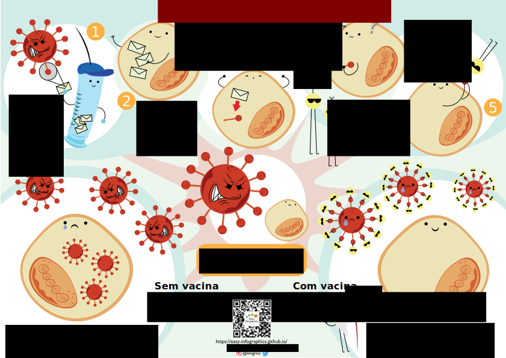
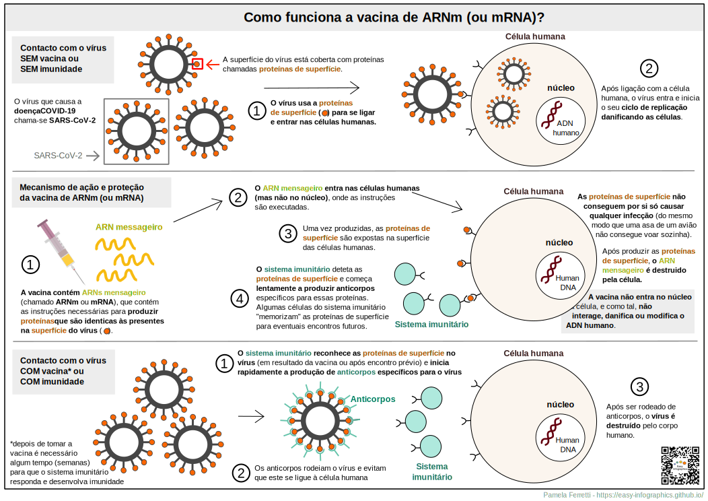

[Ir para a página principal](https://easy-infographics.github.io/)

**Veja também esta página noutras línguas:** 🇮🇹 [Italiano](../it/) 🇬🇧 [Inglês](../en/)

Aqui pode encontrar uma coleção de infografias sobre COVID-19.
Quando não criadas por mim, irá encontrar o nome do autor por baixo da ilustração.
**Estas ilustrações têm como finalidade responder de forma clara e simples a
perguntas específicas que me foram feitas**.

# Como funciona a vacina COVID-19 mRNA (ou ARNm)?

Esta ilustração visa mostrar, de uma forma colorida e divertida, o que acontece
quando o vírus SARS-CoV-2 encontra uma célula humana. Estão presentes três cenários na ilustração: antes, durante e depois da vacinação ou exposição ao vírus.
-> insetad of "The illustration below aims to show, in a colorful, fun and simple way, what does the mRNA vaccine do once injected in our body, and what happens when a human cell encounters the virus with and without the vaccination."

Créditos desta ilustração: Eleonora Nigro ([@enigrox](https://twitter.com/enigrox))

Here you can see an alternative illustration of what happens during vaccination and to our cells when they come into contact with SARS-CoV-2 (the virus that causes the COVID-19 disease) with and without the vaccination with the mRNA vaccine. 
-> instead of "Aqui pode ver o que acontece às nossas células quando encontram o vírus SARS-CoV-2 (o vírus que causa a doença COVID-19) **antes, durante e depois da vacinação com a vacina de mRNA.**" 

Vacinas de mRNA não são o único tipo de vacina contra a COVID-19, mas para simplicidade são as únicas descritas nesta infografia.
À data deste texto, as vacinas de mRNA aprovadas contra a COVID-19 incluem as produzidas pela Pfizer-BioNTech e Moderna. A imagem da seringa foi obtida de [Pixabay](https://pixabay.com/users/janjf93-3084263/)

### Porque são as vacinas úteis?
**Vacinação permite ao nosso sistema imunitário "memorizar" o vírus. Caso ocorra um futuro encontro com o vírus, o nosso corpo é capaz de responder
rapidamente e de forma eficaz e eficiente.**

### Mas afinal de contas o que é um mRNA (ou ARNm)?

Nos últimos tempos, ouviu provavelmente menções a vacinas com mRNA ou ARNm.
Apesar aparentemente novidade, o mRNA é tudo menos recente. Na verdade, mRNA é
produzido e destruído nas suas células a cada segundo desde a sua conceção e é
**naturalmente parte de como o nosso organismo funciona.**
**Pode encontrar uma ilustração dedicada na secção de [Biologia Celular](https://easy-infographics.github.io/Cell_Biology).**

mais ilustrações em breve :)

***

### Credits

For creating the illustrations:

* **Pamela Ferretti** : I'm a PhD student in computational biology at EMBL Heidelberg (Germany), where I study bacteria and their role in human health. Twitter: [@pam_ferretti](https://twitter.com/pam_ferretti)

* **Eleonora Nigro** : Twitter: [@enigrox](https://twitter.com/enigrox)

For translating the page, text and illustrations in portughese: **Renato Alves**

### Conflito de interesses

Nenhum.

### Financiamento

Este projeto foi criado no meu tempo livre e com contribuições e revisões de vários
colegas e amigos.

### Licença

Este trabalho está licenciado ao abrigo da licença
[Creative Commons Attribution-ShareAlike 4.0 International License][cc-by-sa].

[![CC BY-SA 4.0][cc-by-sa-image]][cc-by-sa]

[cc-by-sa]: http://creativecommons.org/licenses/by-sa/4.0/
[cc-by-sa-image]: https://licensebuttons.net/l/by-sa/4.0/88x31.png
[cc-by-sa-shield]: https://img.shields.io/badge/License-CC%20BY--SA%204.0-lightgrey.svg
