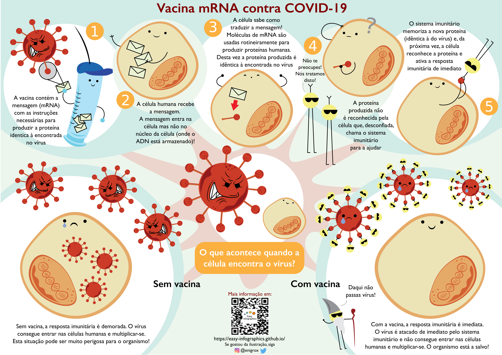

[Ir para a página principal](https://easy-infographics.github.io/pt/)

**Veja também esta página noutras línguas:** 🇮🇹 [Italiano](../it/) 🇬🇧 [Inglês](../en/) 🇫🇷 [Francês](../pt/) 🇩🇪 [Alemão](../de/) 🇪🇸 [Espanhol](../es/)

Aqui pode encontrar uma coleção de infografias sobre COVID-19.
Quando não criadas por mim, irá encontrar o nome do autor por baixo da ilustração.
**Estas ilustrações têm como finalidade responder de forma clara e simples a
perguntas específicas que me foram feitas**.

# Como funciona a vacina COVID-19 mRNA (ou ARNm)?

Esta ilustração visa mostrar, de uma forma colorida e divertida, o que acontece à vacina de mRNA depois de injetada no nosso corpo,
e o que acontece quando uma célula humana encontra o vírus com e sem vacinação.

Autoria da ilustração: Eleonora Nigro ([@enigrox](https://twitter.com/enigrox))

Aqui pode ver uma ilustração alternativa do que acontece durante a vacinação e o que acontece às nossas células quando encontram o vírus SARS-CoV-2 (o vírus que causa a doença COVID-19) **com e sem a vacinação com a vacina de mRNA.**" 

Vacinas de mRNA não são o único tipo de vacina contra a COVID-19, mas para simplicidade são as únicas descritas nesta infografia.
À data deste texto, as vacinas de mRNA aprovadas contra a COVID-19 incluem as produzidas pela Pfizer-BioNTech e Moderna. A imagem da seringa foi obtida de [Pixabay](https://pixabay.com/users/janjf93-3084263/)

### Porque são as vacinas úteis?
**Vacinação permite ao nosso sistema imunitário "memorizar" o vírus. Caso ocorra um futuro encontro com o vírus, o nosso corpo é capaz de responder
rapidamente e de forma eficaz e eficiente.**

### Mas afinal de contas o que é um mRNA (ou ARNm)?

Nos últimos tempos, ouviu provavelmente menções a vacinas com mRNA ou ARNm.
Apesar aparentemente novidade, o mRNA é tudo menos recente. Na verdade, mRNA é
produzido e destruído nas suas células a cada segundo desde a sua conceção e é
**naturalmente parte de como o nosso organismo funciona.**
**Pode encontrar uma ilustração dedicada na secção de [Biologia Celular](https://easy-infographics.github.io/Cell_Biology).**

mais ilustrações em breve :)

***

### Autoria

Responsáveis pelas ilustrações:
 
* **Pamela Ferretti** : Eu sou uma estudante de doutoramento (PhD) em biologia computacional no EMBL em Heidelberg (Alemanha), onde estudo bactérias e o seu papel na saúde humana. [@pam_ferretti](https://twitter.com/pam_ferretti)
 
* **Eleonora Nigro** : Eu sou uma assistente de investigação na Universidade da Copenhaga, onde estudo bactérias e interações de metabolitos com o intestino humano... Além de as estudar, eu gosto de desenhar bactérias em todo o lado! Twitter: [@enigrox](https://twitter.com/enigrox)
 
Responsável pela tradução da página, textos e ilustrações para Português: **Renato Alves**

### Conflito de interesses

Nenhum.

### Financiamento

Este projeto foi criado no meu tempo livre e com contribuições e revisões de vários
colegas e amigos.

### Licença

Este trabalho está licenciado ao abrigo da licença
[Creative Commons Attribution-ShareAlike 4.0 International License][cc-by-sa].

[![CC BY-SA 4.0][cc-by-sa-image]][cc-by-sa]

[cc-by-sa]: http://creativecommons.org/licenses/by-sa/4.0/
[cc-by-sa-image]: https://licensebuttons.net/l/by-sa/4.0/88x31.png
[cc-by-sa-shield]: https://img.shields.io/badge/License-CC%20BY--SA%204.0-lightgrey.svg
