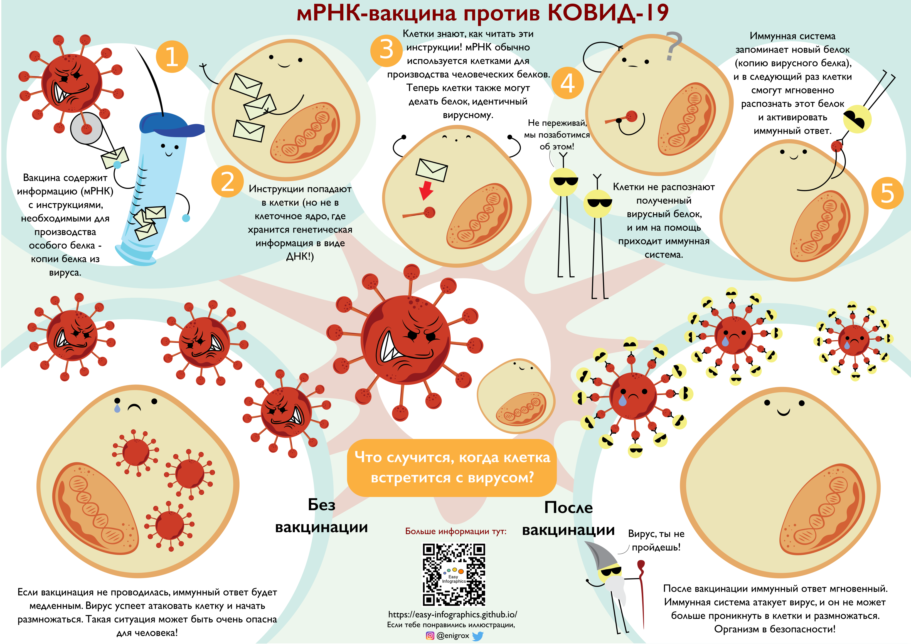
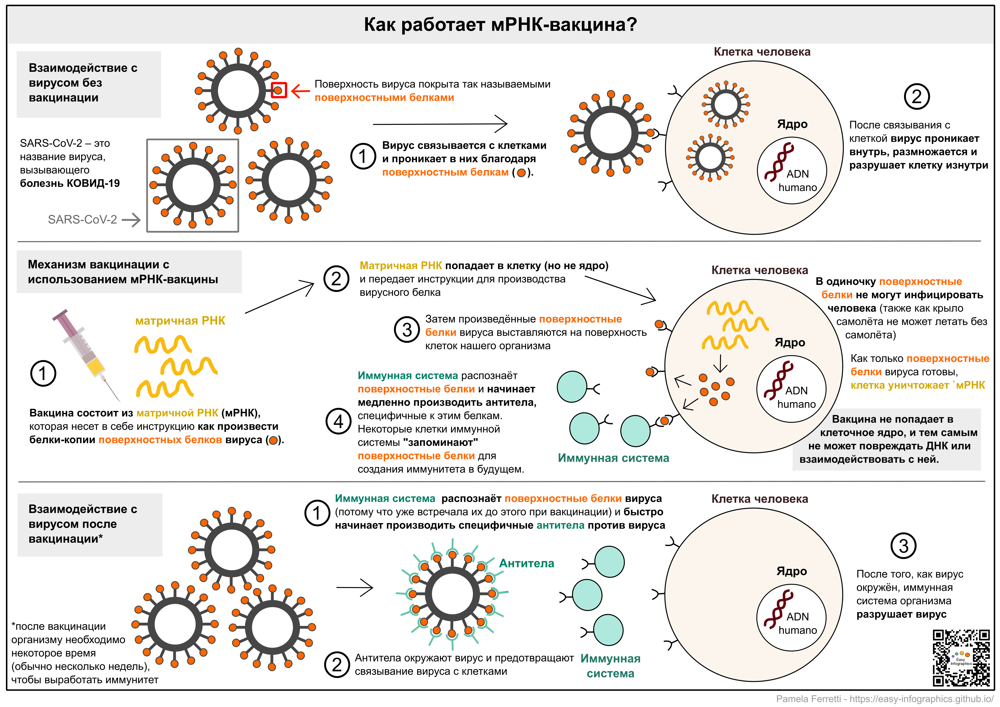

[На главную страницу](https://easy-infographics.github.io/ru/)

**Читайте также на других языках:** 🇮🇹 [Итальянский](../it/) 🇬🇧 [Английский](../) 🇫🇷 [Французский](../fr/) 🇩🇪 [Немецкий](../de/) 🇪🇸 [Испанский](../es/) 🇵🇹 [Португальский](../pt/)

Здесь вы найдете коллекцию инфографики о КОВИД-19. Все иллюстрации созданы мной и другими авторами (имена указаны под иллюстрациями). 
**Цель приведенных ниже иллюстраций - дать простой и понятный ответ на конкретные вопросы о вакцине против КОВИД-19.**. 

# Как работает мРНК-вакцина против КОВИД-19?

На приведенном ниже рисунке в забавной и понятной форме показано, как работает мРНК-вакцина при введении в наш организм, и что происходит, когда клетки нашего тела сталкиваются с вирусом после вакцинации, или же что происходит, если вакцинация не проводилась.

Автор иллюстрации: Eleonora Nigro ([@enigrox](https://twitter.com/enigrox))

Ниже приведена ещё одна иллюстрация, которая демонстрирует, что происходит в клетках во время вакцинации, и что случается, когда клетки вступают в контакт с SARS-CoV-2 (вирусом, вызывающим болезнь КОВИД-19) **после вакцинации мРНК-вакциной, или если вакцинация не проводилась.**

Вакцины на основе мРНК - не единственный доступный тип вакцины против КОВИД-19, но для простоты в данной инфографике мы ограничиваемся только описанием мРНК-вакцины. Одобренные вакцины на основе мРНК против КОВИД-19 производят компании Pfizer-BioNTech и Moderna. Обратите внимание, что на момент публикации этого материала описанный тип вакцины на основе мРНК недоступен в России.
Иллюстрация шприца [Pixabay](https://pixabay.com/users/janjf93-3084263/).

### Почему нужны вакцины?
**Вакцины помогают нашей иммунной системе "запомнить" вирус. В случае, когда наш организм встретится с вирусом в будущем, он сможет быстро и эффективно среагировать на него.**

### Что вообще такое мРНК? 

Несмотря на то, что вы могли услышать об мРНК совсем недавно в новостях об мРНК-вакцинах, мРНК — это не новое изобретение. На самом деле, мРНК производится и разрушается нашими клетками каждую секунду с момента зачатия, и это **естественная работа нашего организма.**
**Вы можете найти больше информации об мРНК в разделе [Клеточная биология](https://easy-infographics.github.io/Cell_Biology/ru/).**

скоро будет больше иллюстраций :)

***

### Авторы

Авторы иллюстраций:

* **Pamela Ferretti**: Аспирант, занимаюсь компьютерной биологией в институте EMBL Гейдельберг (Германия), где я изучаю бактерии и их влияние на здоровье человека. Twitter: [@pam_ferretti](https://twitter.com/pam_ferretti)

* **Eleonora Nigro**: Научный ассистент в Университете Копенгагена. Изучаю взаимодействия бактерий и их метаболитов в кишечнике человека... Кроме того, что я изучаю бактерии, я обожаю их рисовать! Twitter: [@enigrox](https://twitter.com/enigrox)

Перевод на РУССКИЙ ЯЗЫК: **Мария Беляева**. Отдельное спасибо **Виктории Синтялёвой** за помощь в редактировании перевода.

### Конфликт интересов

Отсутствует.

### Финансирование

Данный проект — это результат моей работы в свободное время, а также моего коллеги, который помогал в процессе создания и редактирования текстов и иллюстраций.

### Лицензия

Эта работа лицензируется в соответствии с
[Creative Commons Attribution-ShareAlike 4.0 International License][cc-by-sa].

[![CC BY-SA 4.0][cc-by-sa-image]][cc-by-sa]

[cc-by-sa]: http://creativecommons.org/licenses/by-sa/4.0/
[cc-by-sa-image]: https://licensebuttons.net/l/by-sa/4.0/88x31.png
[cc-by-sa-shield]: https://img.shields.io/badge/License-CC%20BY--SA%204.0-lightgrey.svg
