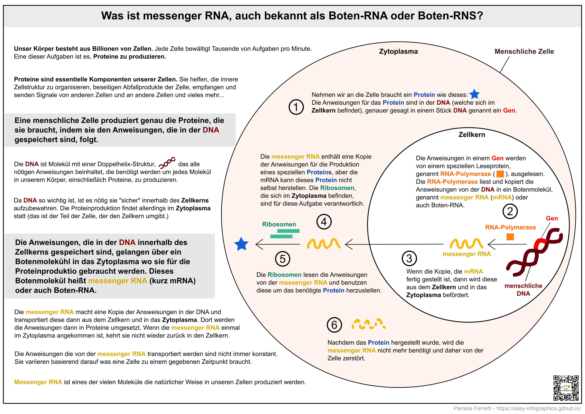

[Zurück zur Startseite](https://easy-infographics.github.io/de/)

**Schauen Sie sich diese Seite auch in anderen Sprachen an:**🇮🇹  [Italienisch](/it/) 🇵🇹 [Portugiesisch](../pt/) 🇫🇷 [Französisch](../fr/) 🇬🇧 [Englisch](../) 🇪🇸 [Spanisch](../es/)

Im Folgenden findest du eine Sammlung von Infografiken rund um Zellbiologie.
**Diese Illustrationen versuchen spezielle Fragen, die mir persönlich gestellt wurden, in einfacher und klarer Weise zu beantowrten.**

# Was ist messenger RNA oder mRNA, auch bekannt als Boten RNA/RNS?

Die messenger RNA (oder kurz mRNA) ist ein essentielles Molekül in unseren Zellen, das es unserem Körper  ermöglicht, Proteine nach den Anweisungen in der DNA zu produzieren. Messenger RNA wird jederzeit auf natürliche und kontinuierliche Weise in den Zellen unseres Körpers hergestellt.

**Falls es dich interessiert wie das mRNA Vakzin gegen COVID-19 funktioniert, dann schau dir den [COVID-19](https://easy-infographics.github.io/COVID-19/de/) Abschnitt an.**

Mehr Infografiken folgen :)  

***

### Über uns

Erstellung der Illustrationen:

* **Pamela Ferretti** : Ich bin Doktorandin am EMBL Heidelberg und forsche dort mithilfe von Bioinformatik an Bakterien und ihrer Rolle für die menschliche Gesundheit. Twitter: [@pam_ferretti](https://twitter.com/pam_ferretti)

Übersetzung dieser Seite, des Textes und der Illustrationen in Deutsch: **Julia Philipp**

### Interessenkonflikte

Keine.

### Finanzierung

Dieses Projekt ist das Resultat meiner Freizeit und der Freizeit all derer, die mir geholfen und mich beraten haben.

### Lizenz

Diese Arbeiten sind publiziert unter der 
[Creative Commons Attribution-ShareAlike 4.0 International License][cc-by-sa].

[![CC BY-SA 4.0][cc-by-sa-image]][cc-by-sa]

[cc-by-sa]: http://creativecommons.org/licenses/by-sa/4.0/
[cc-by-sa-image]: https://licensebuttons.net/l/by-sa/4.0/88x31.png
[cc-by-sa-shield]: https://img.shields.io/badge/License-CC%20BY--SA%204.0-lightgrey.svg
