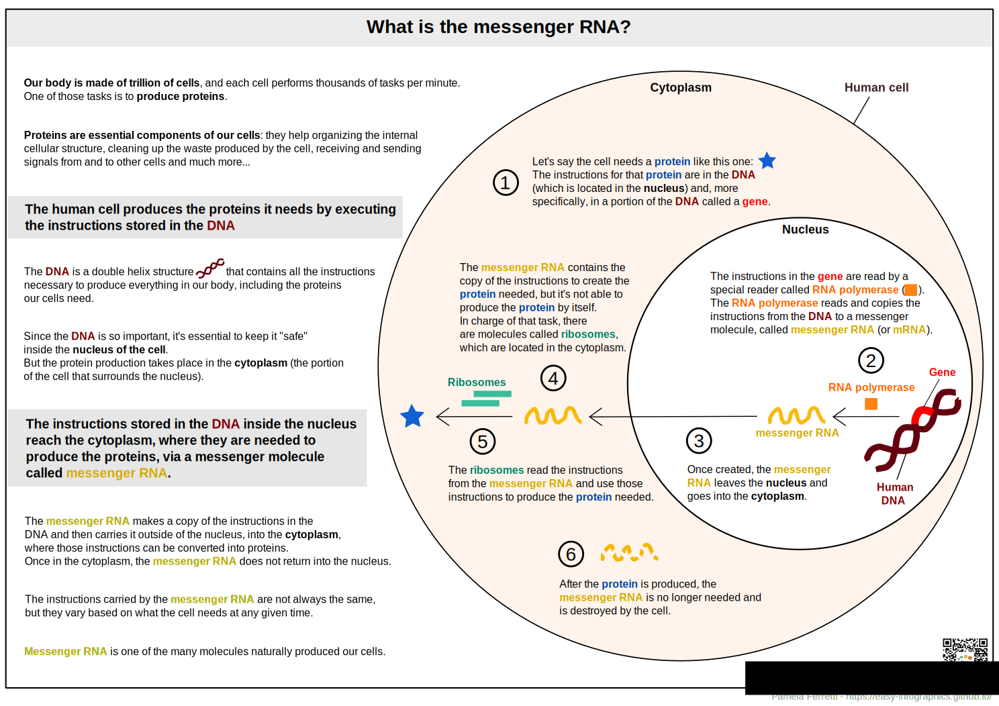

[Go to the main page](https://easy-infographics.github.io/)

**Check out this page also in other languages:** 🇮🇹  [Italian](../it/)  🇵🇹 [Portuguese](../pt/)

Below you will find a collection of infographics on cellular biology. 
**These illustrations aim to answer, in a clear and simplified way, specific questions that were asked to me.** 

# What is the messenger RNA or mRNA? 

The messenger RNA (or mRNA) is an essential element of our cells, that allows our body to create proteins using the set of instructions present in our DNA. Messenger RNA is naturally and continuously produced by the cells of our body at any given time. 

**If you are interested in how the mRNA vaccine for COVID-19 works, check out the [COVID-19](https://easy-infographics.github.io/COVID-19/en/) section.**

more illustrations coming soon :)

***

### Conflict of interests

None.

### Funding

This project is the result of my spare time, and the one of the people that collaborated in the process of making and revising the illustrations. 

### License

This work is licensed under a
[Creative Commons Attribution-ShareAlike 4.0 International License][cc-by-sa].

[![CC BY-SA 4.0][cc-by-sa-image]][cc-by-sa]

[cc-by-sa]: http://creativecommons.org/licenses/by-sa/4.0/
[cc-by-sa-image]: https://licensebuttons.net/l/by-sa/4.0/88x31.png
[cc-by-sa-shield]: https://img.shields.io/badge/License-CC%20BY--SA%204.0-lightgrey.svg
