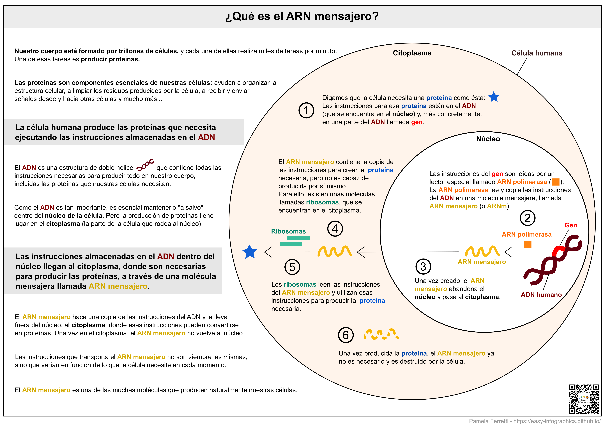

[Ir a la página principal](https://easy-infographics.github.io/es/)

**Mira esta página también en otros idiomas:** 🇮🇹  [Italiano](../it/) 🇵🇹 [Portugués](../pt/) 🇬🇧 [Inglés](../) 🇫🇷 [Francés](../fr/) 🇩🇪 [Alemán](../de/)

A continuación encontrarás una colección de infografías sobre biología celular. 
**Estas ilustraciones pretenden responder, de forma clara y simplificada, a preguntas concretas que me han planteado.** 

# ¿Qué es el ARN mensajero o ARNm? 

El ARN mensajero (o ARNm) es un elemento esencial de nuestras células, que permite a nuestro organismo crear proteínas utilizando el conjunto de instrucciones presentes en nuestro ADN. El ARN mensajero es producido de forma natural y continua por las células de nuestro cuerpo en cualquier momento. 

**Si estás interesado en cómo funciona la vacuna de ARNm para COVID-19, consulta la sección [COVID-19](https://easy-infographics.github.io/COVID-19/es/).**

pronto habrá más ilustraciones :)

***

### Créditos

Por la creación de las ilustraciones:

* **Pamela Ferretti** : Soy estudiante de doctorado en biología computacional en el EMBL de Heidelberg (Alemania), donde estudio las bacterias y su papel en la salud humana. 

Para traducir la página, el texto y las ilustraciones en español: **Miguelangel Cuenca**

### Conflicto de intereses

Ninguno.

### Financiación

Este proyecto es el resultado de mi tiempo libre, y el de las personas que colaboraron en el proceso de realización y revisión de las ilustraciones. 

### Licencia

Este trabajo está licenciado bajo una

[Creative Commons Attribution-ShareAlike 4.0 International License][cc-by-sa].

[![CC BY-SA 4.0][cc-by-sa-image]][cc-by-sa]

[cc-by-sa]: http://creativecommons.org/licenses/by-sa/4.0/
[cc-by-sa-image]: https://licensebuttons.net/l/by-sa/4.0/88x31.png
[cc-by-sa-shield]: https://img.shields.io/badge/License-CC%20BY--SA%204.0-lightgrey.svg
