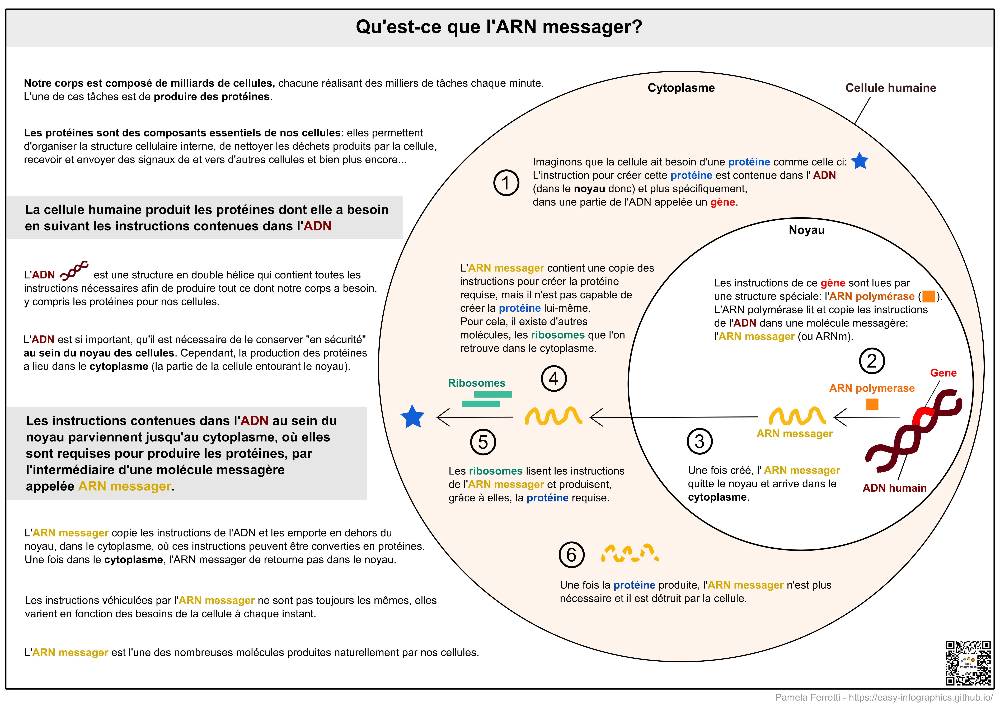

Page d'accueil](https://easy-infographics.github.io/)

**Accéder à cette page dans une autre langue** 🇮🇹  [Italien](../it/) 🇵🇹 [Portugais](../pt/) 🇬🇧 [Anglais](../en/)

Vous trouverez ci-dessous une série d'illustrations sur la biologie cellulaire.
**Ces illustraitions ont pour but de répondre de manière claire et concise à des questions spécifiques qui m'ont été posées**.

# Qu'est-ce qu'un ARN messager ou ARNm?

L'ARN messager (or ARNm) est un élément essentiel de nos cellules, permettant à nos corps de créer des protéines en suivant les instructions présentes dans notre ADN. L'ARN messager est naturellement et continuellement produit dans nos cellules à chaque instant.

**Si vous êtes intéressés par le fonctionnement du vaccin à ARNm contre la Covid-19, consultez la section [COVID-19](https://easy-infographics.github.io/COVID-19/fr/)**

plus d'illustrations à venir :)

***

### Remerciements

Pour les illustrations :

* **Pamela Ferretti** : étudiante en thèse en biologie computationnelle à l'EMBL de Heidelberg (Allemagne) où elle étudie les bactéries et leur rôle sur la santé humaine. Twitter: [@pam_ferretti](https://twitter.com/pam_ferretti)

* **Eleonora Nigro** : assistante de recherche à l'Université de Copenhague, où elle étudie les bactéries et les interactions métaboliques dans l'intestin humain. Outre l'étude des bactéries, elle adore en dessiner partout! Twitter: [@enigrox](https://twitter.com/enigrox)

Pour la traduction de la page, du texte et des illustraitons en français: **Léonard Dubois**

### Conflits d'interêts

Aucun.

### Financement

Ce projet est le fruit du travail bénévole de chacun de ses contributeurs (création, révisions, traduction des illustrations).

### Licence

Ce travail est distribué sous licence
[Creative Commons Attribution-ShareAlike 4.0 International License][cc-by-sa].

[![CC BY-SA 4.0][cc-by-sa-image]][cc-by-sa]

[cc-by-sa]: http://creativecommons.org/licenses/by-sa/4.0/
[cc-by-sa-image]: https://licensebuttons.net/l/by-sa/4.0/88x31.png
[cc-by-sa-shield]: https://img.shields.io/badge/License-CC%20BY--SA%204.0-lightgrey.svg
