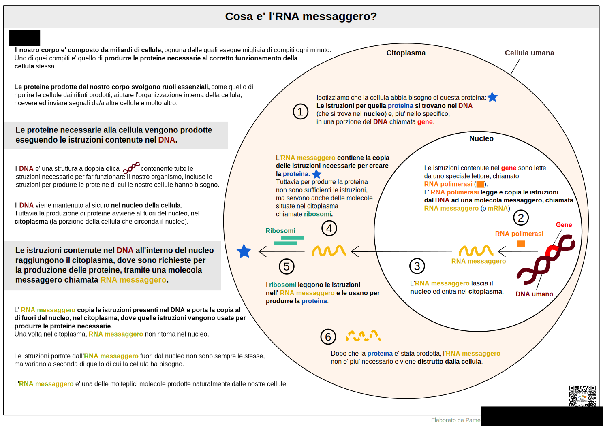

[Vai alla Home](https://easy-infographics.github.io/it/)

**Visualizza questa pagina in:** 🇬🇧 [Inglese](../en/) 🇵🇹 [Portoghese](../pt/)

In questa sezione sono raccolte le infografiche sull'argomento "biologia della cellula". 
**Queste illustrazioni hanno lo scopo di rispondere, in modo semplice e chiaro, a specifiche domande che mi sono state poste.** 

# Cosa e' l' RNA messaggero o mRNA? 

L'RNA messaggero (o mRNA) e' un elemento essenziale delle nostre cellule, in quanto consente al nostro corpo di produrre proteine usando le istruzioni contenute nel nostro DNA. L'RNA messaggero viene continuamente prodotto dalle cellule del nostro corpo, in modo del tutto naturale.  

**Se vuoi maggiori infomazioni su come funziona il vaccino ad RNA messaggero contro il COVID-19, visita la sezione [COVID-19](https://easy-infographics.github.io/COVID-19/it/).** 

Altre illustrazioni sono in preparazione :)

***

### Dichiarazione di conflitto di interessi

Nessuno.

### Finanziamento

Nessuno. 

### Licenza

Quest’opera è stata rilasciata con licenza 
[Creative Commons Attribution-ShareAlike 4.0 International License][cc-by-sa].

[![CC BY-SA 4.0][cc-by-sa-image]][cc-by-sa]

[cc-by-sa]: http://creativecommons.org/licenses/by-sa/4.0/
[cc-by-sa-image]: https://licensebuttons.net/l/by-sa/4.0/88x31.png
[cc-by-sa-shield]: https://img.shields.io/badge/License-CC%20BY--SA%204.0-lightgrey.svg
