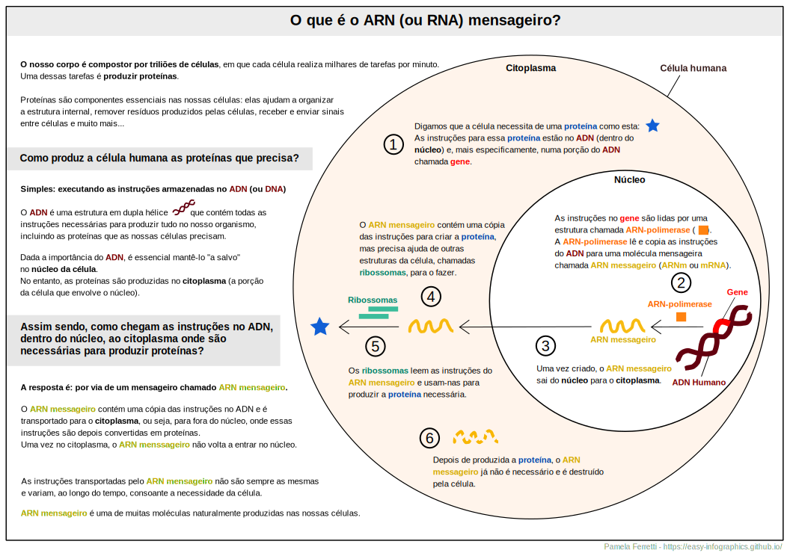

[Ir para a página principal](https://easy-infographics.github.io/)

**Veja também esta página noutras línguas:** 🇮🇹 [Italiano](../it/) 🇬🇧 [Inglês](../en/)

Aqui pode encontrar uma coleção de infografias sobre biologia celular.
**Estas ilustrações têm como finalidade responder de forma clara e simples a
perguntas específicas que me foram feitas**.

# O que é o ARN mensageiro, ARNm ou mRNA?

O ARN mensageiro (ARNm or mRNA) é um elemento essencial das nossas células, que permite ao nosso corpo criar proteínas utilizando as instruções presentes no nosso ADN.
ARN mensageiros são produzidos naturalmente e de forma contínua pelas células do nosso organismo a todos os instantes.

**Se está interessado em saber como funciona a vacina mRNA para COVID-19, visite a secção [COVID-19](https://easy-infographics.github.io/COVID-19/en/) neste site.**

mais ilustrações em breve :)

***

### Credits

For creating the illustrations:

* **Pamela Ferretti** : I'm a PhD student in computational biology at EMBL Heidelberg (Germany), where I study bacteria and their role in human health. Twitter: [@pam_ferretti](https://twitter.com/pam_ferretti)

For translating the page, text and illustrations in portughese: **Renato Alves**

### Conflito de interesses

Nenhum.

### Financiamento

Este projeto foi criado no meu tempo livre e com contribuições e revisões de vários
colegas e amigos.

### Licença

Este trabalho está licenciado ao abrigo da licença
[Creative Commons Attribution-ShareAlike 4.0 International License][cc-by-sa].

[![CC BY-SA 4.0][cc-by-sa-image]][cc-by-sa]

[cc-by-sa]: http://creativecommons.org/licenses/by-sa/4.0/
[cc-by-sa-image]: https://licensebuttons.net/l/by-sa/4.0/88x31.png
[cc-by-sa-shield]: https://img.shields.io/badge/License-CC%20BY--SA%204.0-lightgrey.svg
