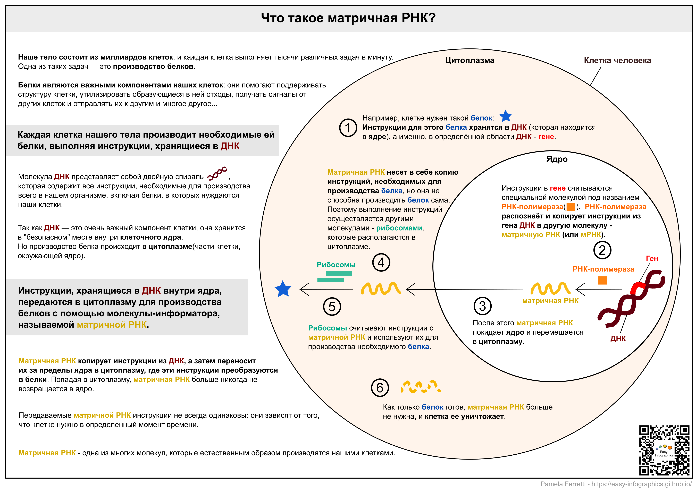

[На главную страницу](https://easy-infographics.github.io/ru/)

**Читайте также на других языках:** 🇮🇹 [Итальянский](../it/) 🇬🇧 [Английский](../) 🇫🇷 [Французский](../fr/) 🇩🇪 [Немецкий](../de/) 🇪🇸 [Испанский](../es/) 🇵🇹 [Португальский](../pt/)

Здесь вы найдете коллекцию инфографики по клеточной биологии. 
**Цель приведенных ниже иллюстраций - дать простой и понятный ответ на конкретные вопросы о вакцинах и принципе работы клеток.** 

# Что такое матричная РНК, или мРНК? 

Матричная РНК (или мРНК) — это важный компонент наших клеток, который позволяет нашему организму производить белки, используя набор инструкций, переданных из ДНК. Каждую минуту клетки нашего тела непрерывно вырабатывают матричную РНК. 

**Если вам интересно, как работает мРНК-вакцина от КОВИД-19, посмотрите страницу [COVID-19](https://easy-infographics.github.io/COVID-19/ru/).**

скоро будет больше иллюстраций :)

***

### Авторы
 
Авторы иллюстраций:

* **Pamela Ferretti**: Аспирант, занимаюсь компьютерной биологией в институте EMBL Гейдельберг (Германия), где я изучаю бактерии и их влияние на здоровье человека. Twitter: [@pam_ferretti](https://twitter.com/pam_ferretti)

* **Eleonora Nigro**: Научный ассистент в Университете Копенгагена. Изучаю взаимодействия бактерий и их метаболитов в кишечнике человека... Кроме того, что я изучаю бактерии, я обожаю их рисовать! Twitter: [@enigrox](https://twitter.com/enigrox)

Перевод на РУССКИЙ ЯЗЫК: **Мария Беляева**. Отдельное спасибо **Виктории Синтялёвой** за помощь в редактировании перевода.

### Конфликт интересов

Отсутствует.

### Финансирование

Данный проект — это результат моей работы в свободное время, а также моего коллеги, который помогал в процессе создания и редактирования текстов и иллюстраций.

### Лицензия

Эта работа лицензируется в соответствии с
[Creative Commons Attribution-ShareAlike 4.0 International License][cc-by-sa].

[![CC BY-SA 4.0][cc-by-sa-image]][cc-by-sa]

[cc-by-sa]: http://creativecommons.org/licenses/by-sa/4.0/
[cc-by-sa-image]: https://licensebuttons.net/l/by-sa/4.0/88x31.png
[cc-by-sa-shield]: https://img.shields.io/badge/License-CC%20BY--SA%204.0-lightgrey.svg
